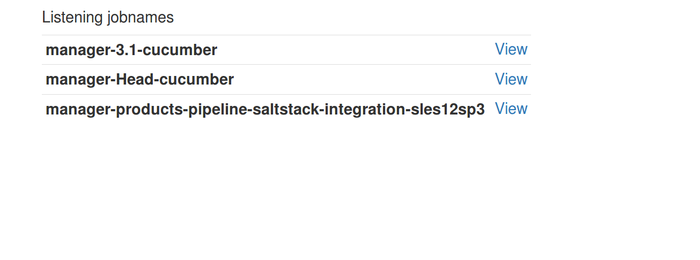
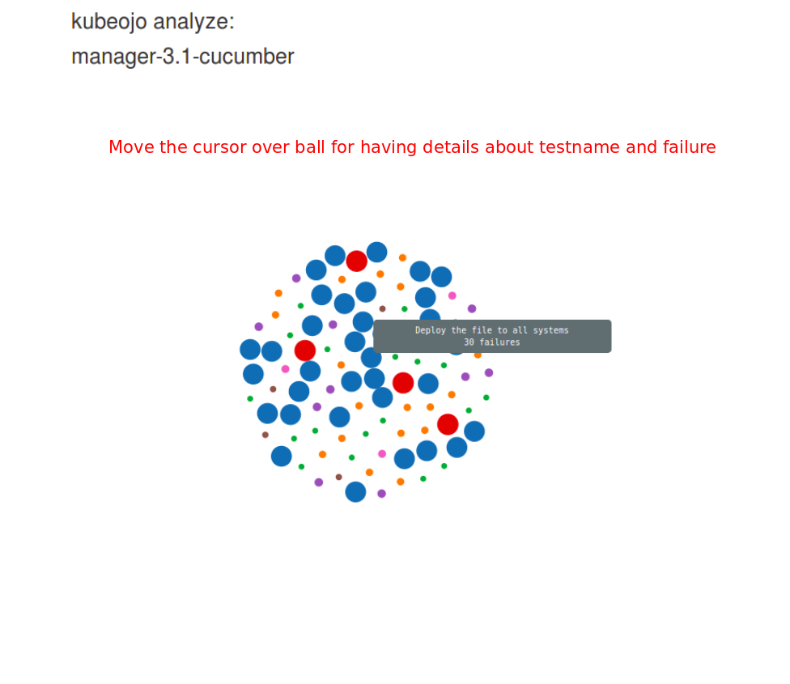
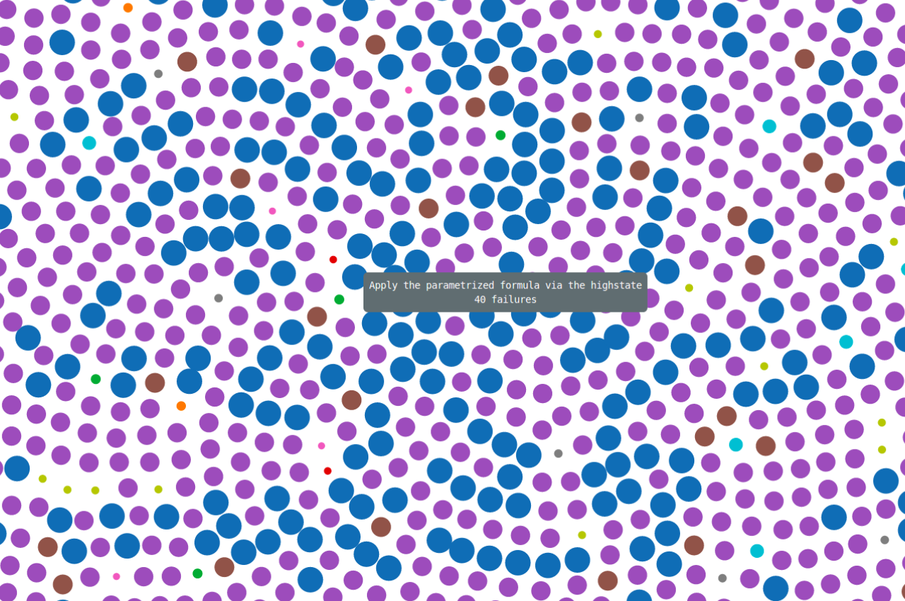

# Kubeojo explained live!

## Let's have a look:

The balls represent test-failures over a period of time. 

A big ball is something that is fragile in your product/software.
It can be a weakness on tests-automation or a bug affecting your software.

Kubeojo index page give you a list of wich job you want to keep track

# How looks like a bubble chart  from kubeojo

### Balls are changing all the time.

Since kubeojo will fetch testsresults overtime, the size of the balls will increase if a tests fails.

