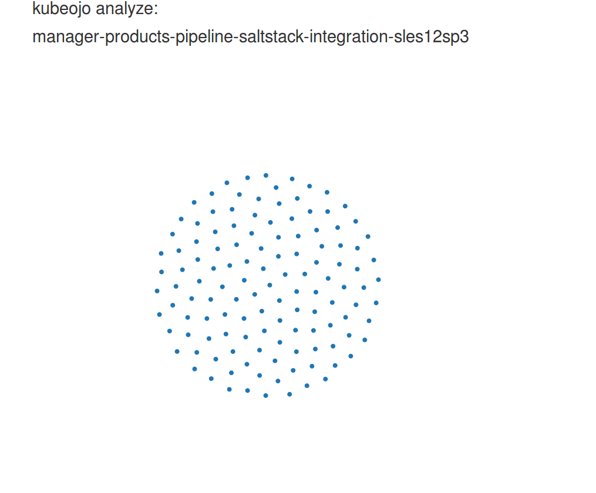

# Kubeojo explained live!

## Let's have a look:

## So we can zoom to search particular failures of sub-categories.

## Balls are changing all the time.

Since kubeojo will fetch testsresults overtime, the size of the balls will increase if a tests fails.

